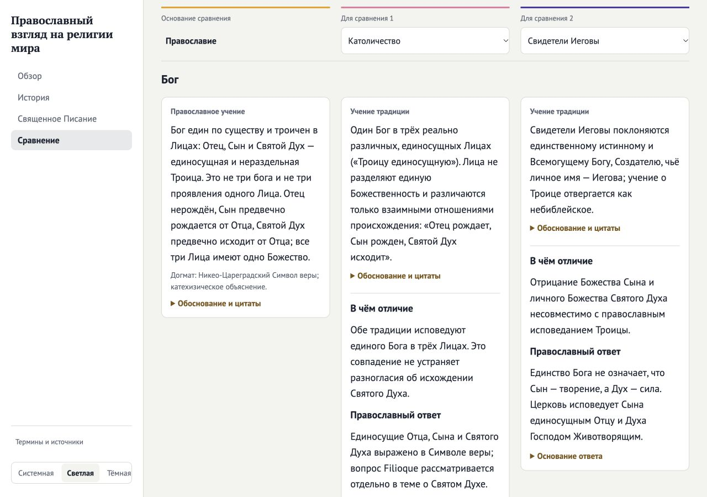

# Orthodox edition: implementation and review

Date: 2026-09-27. Repository: scripture-science. Baseline: db15715.
Status: implementation verified; the owner authorized a consolidated commit
and push on 2026-09-27. Deployment status is reported by the existing GitHub
Pages workflow, not inferred from these local checks.

## Editorial coverage

The [correction register](orthodox-edition-register.json) records the old formulation, reason, replacement, source evidence and correction type for all 15 Orthodox foundations, 105 tradition/topic assessments, 13 disputed questions and 12 migrated Orthodox–Jehovah's Witnesses topics. It also records the dispositions of the homepage, history, Scripture narrative, profiles, reference material and comparison selection.

Each assessment separates another tradition's primary evidence from the Orthodox foundation and identifies the comparison itself as an editorial application. Profiles and comparison pages reuse the same assessment records. Specific disputed questions display only documented participants, with no generic topic-position fallback. The existing three topic groups remain intact.

## Source review

The [passage-check record](orthodox-edition-source-check.json) contains 79 successful matches for the Orthodox foundation's excerpts and quotations. Source titles retain paragraph numbers, document sections or article locations. Hashes identify the retrieved text used for matching; they do not make live web content immutable. Matching normalizes whitespace and spacing introduced by HTML, and does not prove the interpretation of a passage.

Contextual review distinguished these source scopes:

- The historical 22-book arrangement does not contradict the Russian Orthodox Bible's 39 canonical and 11 noncanonical Old Testament books, together with 27 New Testament books.
- The Creed and catechism establish doctrinal foundations. Encyclopedia explanations and named authors do not acquire dogmatic authority merely from being hosted on Azbyka.
- Church Slavonic usage describes Russian Orthodox practice, not a mandatory language of all Orthodox churches.
- The Catholic definition of 1854 concerning Mary's conception is identified separately from Christ's virginal birth. Different Orthodox explanations of Mary's sanctification are not combined into a new dogma.
- Pew's approximately 260 million includes Eastern and Oriental Orthodox populations. This aggregate is retained with its scope in reference material and omitted from the narrower Orthodox comparison card.
- Another tradition's own documents establish its attributed beliefs. Newly corrected LDS Christology, the Holy Spirit and Easter descriptions, Catholic canon/usage and Marian teaching retain their primary references. Historical references not changed by this edition retain their earlier verification metadata; they were not all fetched again.

The hierarchy in [EDITORIAL.md](../EDITORIAL.md) and [SOURCES.md](../SOURCES.md) governs these distinctions. Independent theological acceptance remains a separate manual review step and is not claimed by the owner's delivery authorization. Neither a passing test nor an exact excerpt match constitutes ecclesiastical approval.

## Legacy material and routes

The original pair document and complete imported content remain intact for provenance. The revised public edition integrates its unique arguments into the current topics, moves bibliographies and historical corrections to Sources, and replaces the old public pair page with a route bridge. The continuity disclosure retains the distinct Abel, witnesses, wheat/tares and ordination arguments; its primary JW references and Orthodox response are separate. Four attributed quotations from the old conclusion remain in a documentary Sources disclosure. The fidelity check now tests reproducible import and preservation of the original 1,028 source text nodes, rather than requiring the superseded edition to remain publicly displayed word for word. All 14 historical corrections remain validated.

Existing topic anchors, relevant query parameters and old pair destinations remain usable. History presents the Church continuously from Pentecost; 1054 marks a stage in Rome's separation. The Byzantine chronology remains an identified chronological convention, distinct from the doctrine of creation.

## Verification

`npm run verify` passed: production build, Astro checks with zero errors/warnings/hints, all 114 tests and the source-fidelity check. `git diff --check` passed. Tests exercise default server-rendered selection, insertion of the fixed Orthodox column, duplicate and unknown IDs, empty slots, unavailable storage, reload state, shared links, anchors, assessment coverage, register completeness and retention of the unique legacy arguments and quotations.

Desktop browser checks confirmed:

- The default comparison contains Orthodoxy, Catholicism and Jehovah's Witnesses, with only two editable selectors.
- Clearing the second selector retains the third column, and reload preserves the empty slot.
- A legacy selection without Orthodoxy inserts it first, deduplicates the other choices and preserves extra query parameters and the topic hash.
- A direct disputed-question link opens its disclosure. An old correction link reaches Sources, preserves its query and opens the relevant reference disclosure.
- The world chart remains the default; selecting Australia updates the chart. All 201 country/territory choices remain available.
- The Scripture page separates the Quran and Book of Mormon from the main Bible narrative. The Catholic profile has the revised sequence and all 15 assessments.
- The chronology's Orthodox line continues through Pentecost and later events without the former 1054 start; the historical chapter anchors remain reachable.
- Three comparison columns, evidence disclosures and the light and dark themes remain readable at desktop widths. No horizontal overflow was observed in the final comparison view; no browser console errors were reported during the checked flows.

Final browser confirmation used a fresh local production preview of the verified build. EDGE CASE CANDIDATE: an earlier development listener served stale content while its lifecycle command reported no running server; the sandbox also denied terminating that listener. It was left untouched. Starting the existing preview command on an available port resolved validation without changing configuration or permissions.

The delivery turn repeated `npm run verify`: all 114 tests, the production
build, Astro checks and provenance validation passed. A fresh fetch confirmed
there were no unpublished commits: the current edition can be delivered as
one commit without rewriting published history. The actual diff review found
no introduced correctness defects (No findings). The owner's explicit push
instruction authorizes this delivery; no independent theological review was
performed in the delivery turn.
